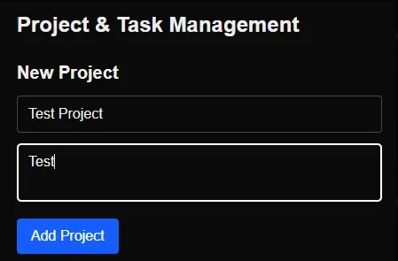
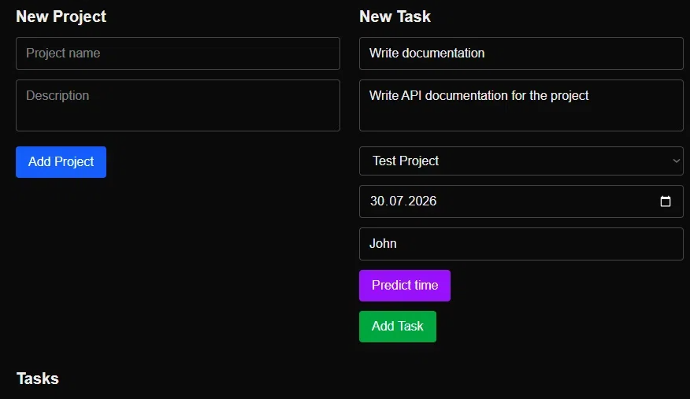
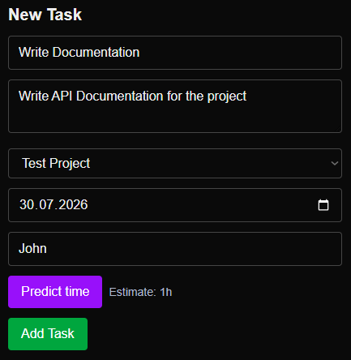
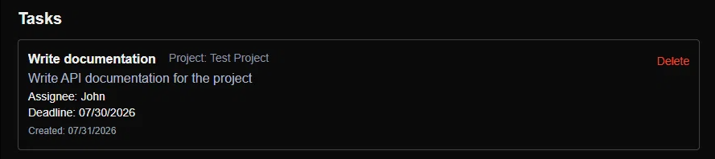

# Task Execution Time Predictor

[](https://tetp-task-execution-time-predictor.onrender.com)
[](LICENSE)
[](https://www.typescriptlang.org/)
[](https://nextjs.org/)
[](https://www.prisma.io/)

---

## What it does

This is a project management tool with one specific feature that most similar systems lack: **AI-powered time estimation for tasks**.

You create projects, add tasks, assign people, set deadlines — and then you can ask the system to guess how long a task might take based on its description. It's not magic, it's just a well-placed LLM call that helps teams plan sprints with less guessing.

**Main flows:**
- Projects and tasks with assignees and deadlines
- AI-based time prediction from task description
- Real-time updates across all clients (WebSocket)
- Clean UI without extra clutter

---

## Tech stack

| Layer | Technology |
|-------|------------|
| Framework | Next.js 16 (App Router) |
| Language | TypeScript |
| Styling | Tailwind CSS |
| Database | PostgreSQL + Prisma |
| Cache | Redis (optional) |
| Real‑time | Socket.IO |
| AI / LLM | Polza API (OpenAI‑compatible) |
| Auth | JWT (http‑only cookies) |
| Deployment | Render |
| CI/CD | GitHub Actions |
| Testing | Jest |

---

## Architecture (short)

- API routes are modular and testable.
- JWT lives in http‑only cookies — no XSS worries.
- WebSocket server (Socket.IO) runs separately from Next.js.
- Migrations via Prisma — everything in code.
- Docker Compose spins up the whole stack locally.

---

## Screenshots

All screenshots are from the live demo.

### Create project


### Create task with prediction


### Time prediction


### Task list


---

## Quick start

```bash
git clone https://github.com/catelizn/task_execution_time_predictor.git
cd task_execution_time_predictor
npm install

# Create .env with your values
cp .env.example .env  # or just create it manually

# Start PostgreSQL and Redis via Docker
docker run --name postgres-dev -e POSTGRES_PASSWORD=mysecretpassword -p 5432:5432 -d postgres:15
docker run --name redis-dev -p 6379:6379 -d redis:7

# Run migrations
npx prisma migrate deploy

# Start Next.js and WebSocket together
npm run dev:all
```

Open `http://localhost:3000` 

---

## Environment variables

Minimal set:

```
DATABASE_URL=postgresql://...
JWT_SECRET=...
POLZA_API_KEY=sk-...
POLZA_BASE_URL=...
```

---

## Tests

```bash
npm test              # all tests
npm run test:watch    # watch mode
npm run test:coverage # coverage report
```

---

## Deployment

The project is deployed on **Render**. On push to `main`:
- GitHub Actions runs tests
- Render rebuilds and redeploys automatically

For your own deployment, you'll need your own PostgreSQL instance (Supabase works fine) and the same environment variables.

---

## License

MIT

---

**Built by [catelizn](https://github.com/catelizn)** 
